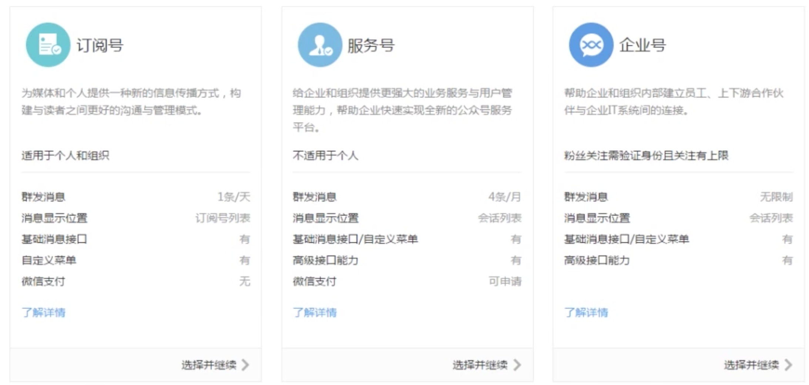
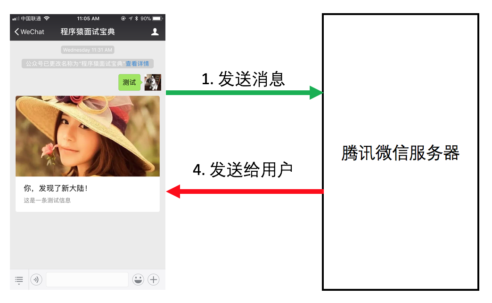
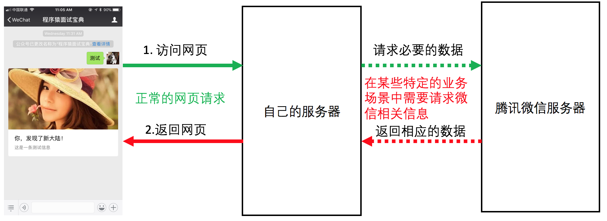

# 微信公众平台

## 概述

<p class="tip">微信公众平台是运营者通过公众号为微信用户提供资讯和服务的平台。</p>

[公众号常见问题](http://kf.qq.com/product/weixinmp.html#hid=97)

[公众号入门指引](https://mp.weixin.qq.com/wiki?t=resource/res_main&id=mp1472017492_58YV5)

## 公众号分类




1. 订阅号：主要偏于为用户传达资讯（类似报纸杂志），认证前后都是每天只可以群发一条消息；
1. 服务号：主要偏于服务交互（类似银行，114，提供服务查询），认证前后都是每个月可群发4条消息；
1. 企业号(现已升级为企业微信)：主要用于公司内部通讯使用，需要先验证身份才可以关注成功企业号。

### 不同类型公众号功能的区别


### 温馨提示

* 如果想简单的发送消息，达到宣传效果，建议可选择订阅号；
* 如果想用公众号获得更多的功能，例如开通微信支付，建议可以选择服务号；
* 如果想用来管理内部企业员工、团队，对内使用，可申请企业号；
* 订阅号可通过微信认证资质test
* 审核通过后有一次升级为服务号的入口，升级成功后类型不可再变；
* 服务号不可变更成订阅号。

## 公众号开发模式

> 公众号开发大致可分为2种模式
> 1. 编辑模式
> 2. 开发模式

### 编辑模式（不需要开发）

公众号默认提供了很多基础的功能，可以在不需要开发者的情况下使用公众号提供一些基础的服务
>在微信公众平台提供的后台管理系统中，可以进行如下的操作：
>1. 设置消息自动回复
>2. 自定义菜单的创建
>3. 主动推送消息给用户
>4. 编辑素材

#### 编辑模式下用户和公众号的交互过程

1. 网络编辑之类的人员通过微信公众号管理后台，编辑公众号中的各项交互功能规则的设置
2. 用户在公众号内发生交互行为
3. 微信服务器根据之前编辑好的规则，对于用户的交互行为返回相应的内容



### 开发模式

微信公众号提供了丰富的功能接口，我们可以大致将微信开发模式分为两种：
1. 基于接口的后台功能开发
2. 公众号内页开发

#### 基于微信公众平台的接口开发模式

1. 用户在公众号内向公众号发送消息
2. 微信服务器在接收到用户发送消息之后，将消息通过开发者提供的接口发送给开发者服务器
3. 开发者服务器接收到消息之后，进行相关的业务处理之后，将处理结果返回给微信服务器
4. 微信服务器再通过消息的形式将开发者服务器返回的内容展示给用户


#### 公众号内页开发

1. 用户通过公众号内的菜单，或者通过消息中的超链接直接向开发者服务器发送网页请求
2. 开发者服务器像正常处理普通网页请求一样做出响应

```text
和普通网页开发不同的是
1. 开发者服务器在特定的业务场景中，可以主动的向微公众平台提供的开发者接口发送请求，实现各项功能（获取用户信息等）
2. 开发者可以在网页上通过JavaScript代码使用微信原生功能的工具包，使用它能在网页上实现录制和播放微信语音、监听微
信分享、上传手机本地图片、拍照等许多功能。
```




## 第三方平台介绍

第三方平台其实就是一个整合微信所有接口功能，实现各项可复用的业务功能（微信小游戏，微信商城等等），用户可以通过第三方平台，在零开发的情况下，实现微信公众号的各项功能。


## 微信公众平台测试号

* 微信公众平台接口测试帐号申请
* 无需公众帐号、快速申请接口测试号
* 直接体验和测试公众平台所有高级接口

[申请地址](https://mp.weixin.qq.com/debug/cgi-bin/sandbox?t=sandbox/login)