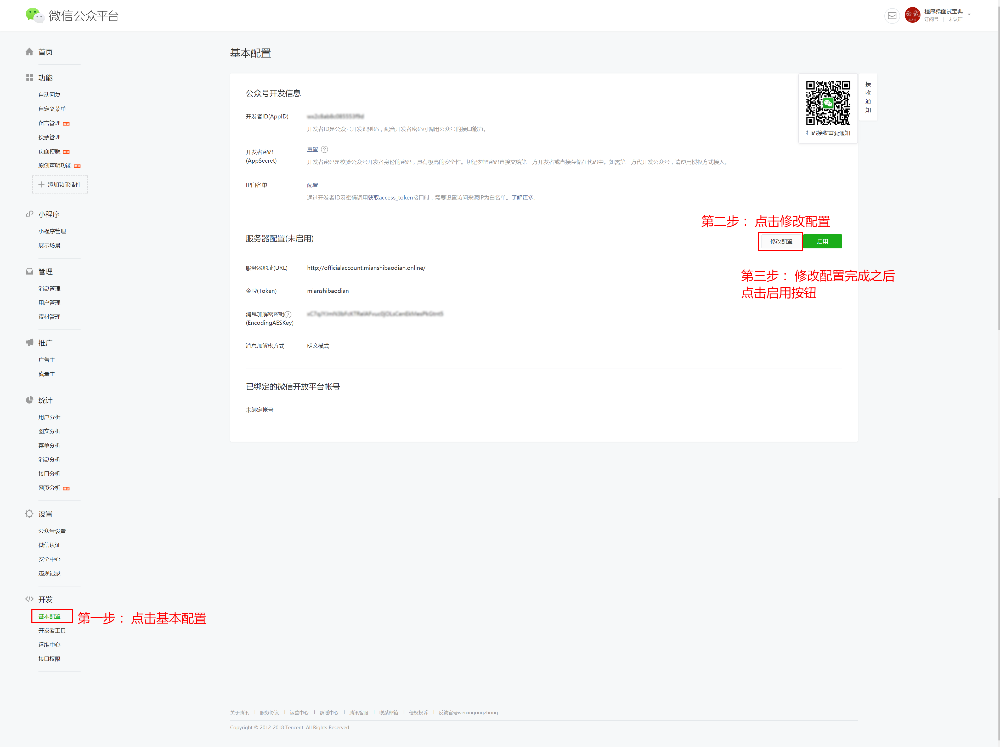
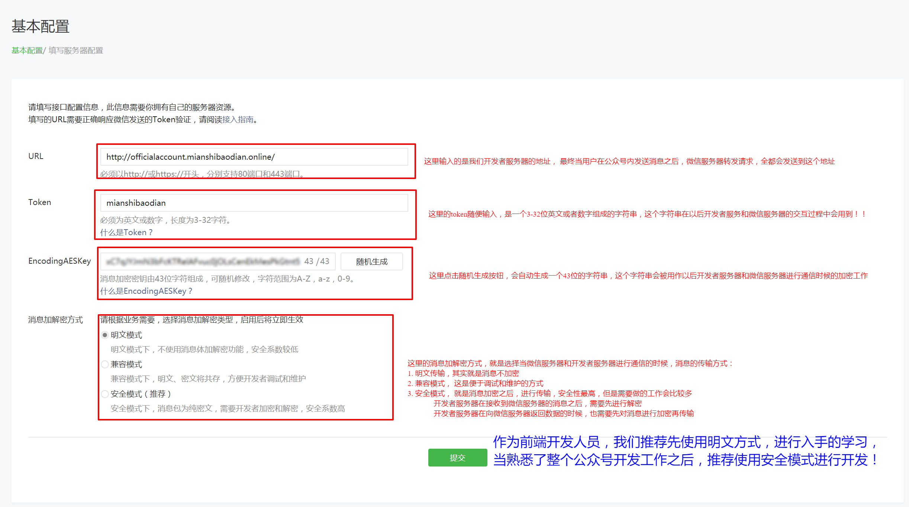

# 聊天机器人

## 图灵聊天机器人

图灵机器人是国内第一家个性化智能机器人开放平台，为广大开发者提供智能机器人API端口。

[图灵机器人接口文档](http://www.tuling123.com/help/h_cent_webapi.jhtml?nav=doc)

[图灵机器人官网](http://www.tuling123.com/)

## 公众号聊天机器人

<p class="tip">技术栈： Node.js + Express + 图灵聊天机器人实现</p>

### 实现步骤

#### 1. 开启公众号开发模式




<p class="warning">上图中提到的开发者服务器的URL， 需要有域名以及服务器，不是随便填写的，开发者需要自行注册域名，以及购买服务器资源，最终将写好的代码部署在服务器上，提供给微信服务器转发消息时进行访问即可</p>

<p class="danger">注意： 在配置URL的时候，点击提交按钮之后，微信服务器会尝试给该URL地址发送一个GET请求，如果请求失败，或是接收到的响应信息不正确，会提示验证token失败</p>

#### 2. 创建服务器代码
由于微信回向开发者配置的URL地址发送GET请求来确定这个地址是否可以正常工作，所以开发者需要在服务器上提供响应的代码，提供功能支持。

##### 微信服务器向开发者服务器发送的GET请求
微信服务器给开发者服务器发送的get请求的携带的参数信息如下：

|参数|描述
|--|--|
|signature|微信加密签名，signature结合了开发者填写的token参数和请求中的timestamp参数、nonce参数。
|timestamp|时间戳
|nonce|随机数
|echostr|随机字符串

开发者服务器接收到微信服务器发送来的get请求之后，首先需要对请求是否来源于微信服务器进行校验（签名校验），校验方式如下：

1.  获取get请求参数中的timestap, nonce两个参数值
2.  将这两个参数，和token（就是你之前在配置页面中的那个token）放到一个数组中
3.  对数组元素进行字典排序
4.  然后把数组中的三个元素拼接成字符串
5.  使用sha1进行加密，获取加密后的签名
6.  对比自己获取到的签名和GET请求参数中的signature是否一致，如果一致，则证明校验成功，否则校验失败

<p class="danger">签名校验的过程，是为了消息的真实性，是出于安全考虑</p>


<p class="tip">校验签名成功之后，我们需要给微信服务器响应刚才GET请求中带过来的参数`echostr`，只有当微信服务器正常接收到这个相应结果后，URL地址配置才算成功</p>


##### 微信转发到开发者服务器的消息说明
接口配置完成之后，点击启用按钮，当用户在公众号内，发送消息的时候, 微信公众号服务器会将消息转发给开发者服务器。

用户发送的消息，微信服务器以POST请求的方式发送给开发者服务器，请求内容是以xml格式进行发送的：

```xml
<xml>
    <ToUserName><![CDATA[公众号]]></ToUserName>
    <FromUserName><![CDATA[粉丝号]]></FromUserName>
    <CreateTime>1460537339</CreateTime>
    <MsgType><![CDATA[text]]></MsgType>
    <Content><![CDATA[这里是用户发送的正文内容]]></Content>
    <MsgId>6272960105994287618</MsgId>
</xml>
```

|参数| 说明|
|--|--|
|ToUserName| 开发者微信号|
|FromUserName| 发送方帐号（一个OpenID）|
|CreateTime|是微信公众平台记录粉丝发送该消息的具体时间（整型）|
|text|消息类型，有很多种 text image voice video shortvideo location link event|
|Content:|消息内容|
|MsgId|是公众平台为记录识别该消息的一个标记数值, 微信后台系统自动产生|

在接收到微信服务器端发来的消息之后，开发者服务器需要对消息进行解析，然后响应。

<p class="danger">微信服务器的等待响应超时时间为5s，如果5s内开发者服务器未响应任何数据，则微信服务器认为此次响应失败，接着会发起重试，总共重试三次。 如果开发者服务器不能保证在5秒内响应，或者不想给用户回复，则需要向微信服务器响应一个success字符串，这样微信服务器就什么都不做，也不会再进行重试</p>

##### 解析微信发来的xml
由于微信发给服务器的消息是`xml`格式的，所以需要从中提取出来有用的信息，必须先对`xml`格式的消息进行解析

<p class="tip">在node.js中，可以使用`xml2js`这个包对`xml`格式的内容进行解析。</p>

[`xml2js` npm地址](https://www.npmjs.com/package/xml2js)

```shell
npm install xml2js -S
```

```js
//引入xml2js包
const xml2js = require("xml2js")
//创建一个将js对象转换成xml的工具对象
//创建这个对象的时候可以传递参数，改变一些内容
//1. rootName: 改变最终生成的xml代码的根节点的名称
//2. cdata:  这个会在必要的时候为节点内容加上<![CDATA[]]>
//3. headless: 这个参数可以去掉doctype
const builder = new xml2js.Builder();


//创建一个将xml字符串转换成js对象的工具对象
//创建这个对象的时候可以传递参数，设置一些功能
//1. explicitArray: 默认是true 会将所有的内容全部以数组的形式存放，设置为false，只会在有多个内容的时候存成数组
const parser = new xml2js.Parser({explicitArray: false});


//将一个xml字符串转成js对象
var xmlStr = "<xml>  <ToUserName>< ![CDATA[toUser] ]></ToUserName>  <FromUserName>< ![CDATA[fromUser] ]></FromUserName>  <CreateTime>1348831860</CreateTime>  <MsgType>< ![CDATA[text] ]></MsgType>  <Content>< ![CDATA[this is a test] ]></Content>  <MsgId>1234567890123456</MsgId>  </xml>"

parser.parseString(xmlStr, (err, result)=>{
    console.log(result);
})


//将一个对象转换成xml字符串
var obj = {
    name: "小明",
    age: 18
}

var xml = builder.buildObject(obj);
```

##### 响应回复消息给微信服务器

在解析完微信服务器发送过来的消息之后，开发者服务器需要对其进行回复，回复的规则，由开发者服务器自行制定。

<p class="tip">开发者服务器回复给微信服务器的消息格式和微信服务器发送过来的消息格式基本一致, 只是需要将`ToUserName`和`FromUserName`进行对调，然后将`Content`设置为要回复的内容即可</tip>

##### 图灵机器人接口的使用
在接收到微信发来的消息之后，我们可以将消息转发给图灵机器人接口，获取相应的回复，然后将回复内容响应给微信服务器

首先需要注册一个图灵机器人账号，账号注册好之后，创建一个机器人，会有相应的参数信息分配好

图灵机器人接口说明

|选项|说明|
|--|--|
|url|http://www.tuling123.com/openapi/api|
|参数：|{key: "图灵账号的APIKEY", info: "要发送给图灵机器人的消息", userid: "用户唯一标志（对应开发者服务器的每一个用户）"}|
|请求方式|post|