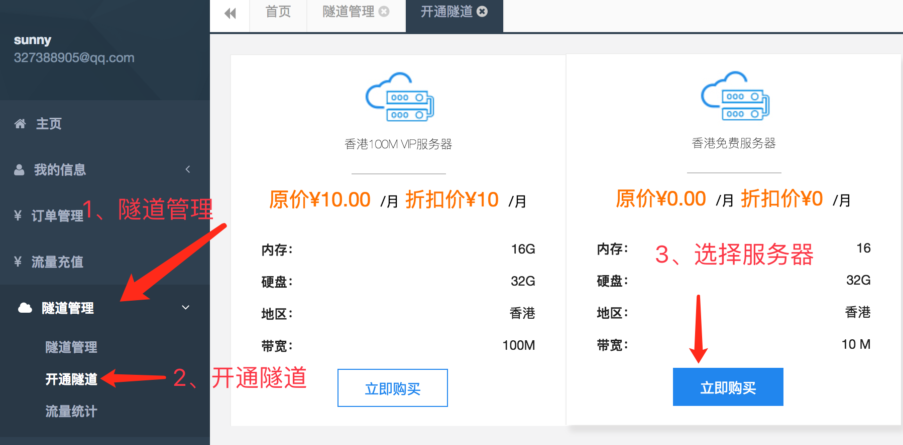
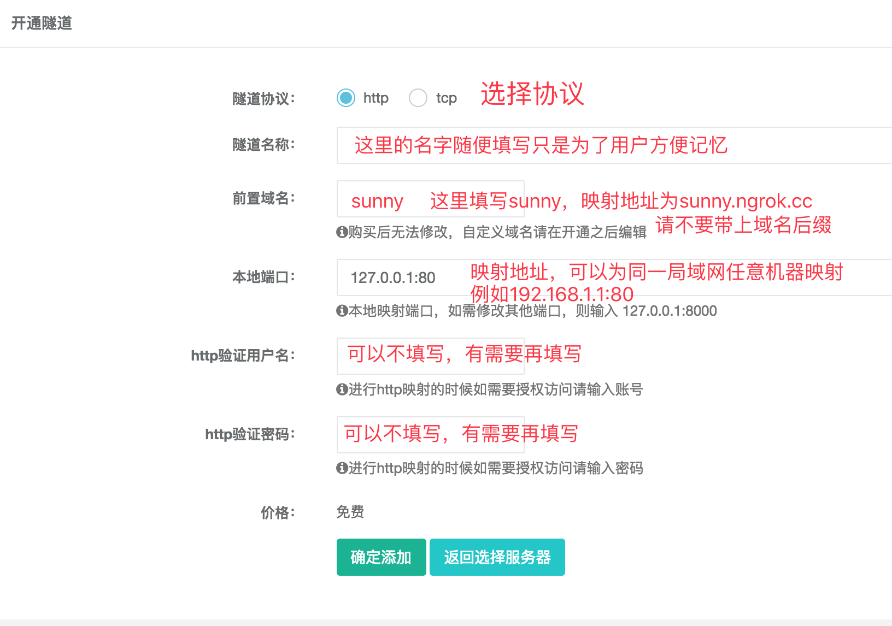
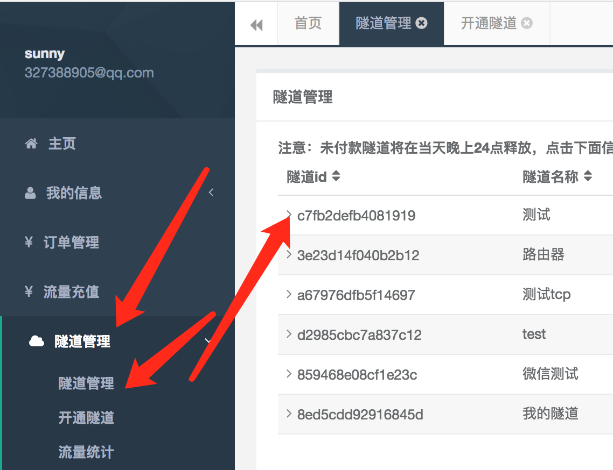

# ngrok

## ngrok说明
在进行服务器端开发的时候，我们所编写的服务器端程序，需要放在服务器上运行，最终提供给用户域名进行访问。

正常的流程，我们需要自己购买服务器，注册域名（这个过程省略，自行查找资料，当前教程中我们不使用）

在学习阶段，我们可以将自己的电脑作为服务器，但是如果需要从外网访问我们自己的电脑上的服务器资源，通过正常的域名解析流程，很难实现，因为我们使用的个人电脑一般都是以动态ip接入互联网的，并且通常存在路由器组建的内网。

***ngrok给我们提供了，可以将自己电脑作为服务器，并且提供外网访问地址的方式！***

## ngrok使用
[ngrok官网](https://www.ngrok.cc)

### 使用步骤如下：

#### 第一步，ngrok网站配置
1. 注册ngrok账号
2. 登录ngrok后台管理
3. 开通隧道

**在上图中表单信息解释**：

|表单项|说明|
|-|-|
|隧道名称|可以随便填写，只是为了使用者在往后之后这个隧道是干嘛的|
|前置域名|服务器免费赠送的域名，请不要带上后缀，如果要`sunny.free.ngrok.cc` 只需要填写 `sunny` 即可 ，千万不要填写成`sunny.free.ngrok.cc`否则域名会是`sunny.free.ngrok.cc.free.ngrok.cc`|
|本地端口|可以为同一个局域网内任意一台机器进行映射，只需要填对ip和端口就行，例如127.0.0.1:80|
|http验证用户名|非必填项，在需要的时候填写，否则可以不填|
|http验证密码|非必填项，在需要的时候填写，否则可以不填|

#### 第二步：本地操作
1. 在本地运行服务器端程序，端口号要和上面写的一致
2. 下载ngrok客户端
3. 运行ngrok客户端，并填写对应的隧道id

客户端id指的就是刚才我们创建好的隧道，在ngrok后台就可以查看

打开浏览器输入自己设置的域名，即可进行访问。如：`http://sunny.free.ngrok.cc`
