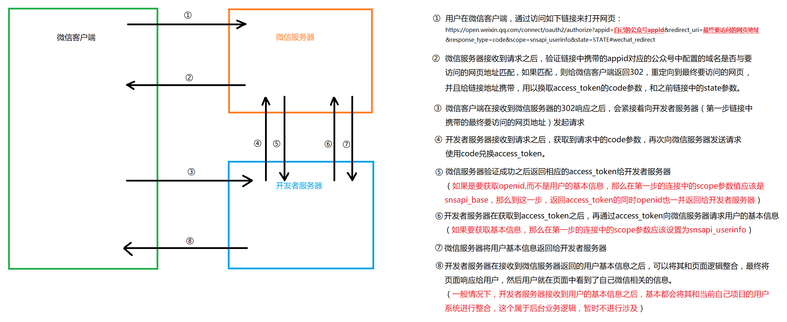

# 微信网页开发

## 网页授权
<p class="warning">这个内容基本属于后端，和前端程序员关系不大</p>
<p class="danger">要实现网页授权，公众号必须认证</p>

>当用户在公众号内打开我们所开发的网页的时候，后台可以获取到用户的一些基本信息，但是这个过程需要用户授权。

### 两种获取信息的方式
1. 获取openid  (scope 为 snsapi_base)
2. 获取用户基本信息（昵称 性别 省份 城市 国家 头像 特权信息）   （scope 为 snsapi_userinfo）

<p class="tip">说白了，其实就是用户在访问我们的页面的时候，打开的不是我们自己的网址，而是微信服务器的一个地址，我们需要把自己网页的网址作为参数传递给这个微信服务器的地址，当微信验证通过后，会通过服务器端操作，让用户跳转到我们自己的网址，跳转的时候，会给我们的网址加上两个参数，一个是`code`一个是`state`。`code`是用来换取`access_token`的凭证，`state`是我们自己定义的内容。然后再通过`access_token`我们就可以获取相应的用户信息了。</p>

### 通过一张图来理清整个授权过程



## 网页开发样式库
WeUI 是一套同微信原生视觉体验一致的基础样式库，由微信官方设计团队为微信内网页和微信小程序量身设计，令用户的使用感知更加统一。

在微信网页或小程序中使用 WeUI，有如下优势：
1. 同微信客户端一致的视觉效果，令所有微信用户都能更容易地使用你的网站或小程序
2. 便捷获取快速使用，降低开发和设计成本
3. 微信设计团队精心打造，清晰明确，简洁大方

该样式库目前包含表单、基础组件、操作反馈、导航相关、搜索相关、层级规范等内容，已经在[GitHub](https://github.com/weui/weui)上开源。访问
[http://weui.io](http://weui.io)


## JS-SDK

微信JS-SDK是基于微信内的网页`开发工具包`。

利用微信JS-SDK，我们可借助微信在网页中拍照、选图、语音、位置等原生app中拥有的功能，同时可以直接使用微信分享、扫一扫、微信卡券、微信支付等微信特有的功能。

### JS-SDK的使用步骤
JS-SDK的使用一共分为5步

#### 1. 域名绑定
先登录微信公众平台进入“公众号设置”的“功能设置”里填写“JS接口安全域名”。
<p class="warning">注意：这里的域名，就是最终使用JS-SDK的网页的域名</p>


<p style="clear:both" class="danger">注意事项</p>


1. 可填写三个域名或路径（例：wx.qq.com或wx.qq.com/mp），需使用字母、数字及“-”的组合，不支持IP地址、端口号及短链域名。
2. 填写的域名须通过ICP备案的验证。
3. 将文件MP_verify_UhBvKrxosbLJmeos.txt（点击下载）上传至填写域名或路径指向的web服务器（或虚拟主机）的目录（若填写域名，将文件放置在域名根目录下，例如wx.qq.com/MP_verify_UhBvKrxosbLJmeos.txt；若填写路径，将文件放置在路径目录下，例如wx.qq.com/mp/MP_verify_UhBvKrxosbLJmeos.txt），并确保可以访问。
4. 一个自然月内最多可修改并保存三次

#### 2. 引入js文件
可以直接将这个文件下载之后引入，也可以直接引入微信服务器上的文件。
[文件链接](http://res.wx.qq.com/open/js/jweixin-1.2.0.js)
```html
<script src="http://res.wx.qq.com/open/js/jweixin-1.2.0.js"></script>
```

<p class="tip">这个文件支持用标准的AMD/CMD的模块方式引入</p>


#### 3. 通过config接口注入权限验证配置
所有需要使用JS-SDK的页面必须先注入配置信息，否则将无法调用（同一个url仅需调用一次，对于变化url的SPA的web app可在每次url变化时进行调用）
```js
wx.config({
    debug: true, // 开启调试模式,调用的所有api的返回值会在客户端alert出来，若要查看传入的参数，可以在pc端打开，参数信息会通过log打出，仅在pc端时才会打印。
    appId: '', // 必填，公众号的唯一标识
    timestamp: , // 必填，生成签名的时间戳
    nonceStr: '', // 必填，生成签名的随机串
    signature: '',// 必填，签名，签名生成算法见附录1
    jsApiList: [] // 必填，需要使用的JS接口列表，所有JS接口列表见附录2
});
```

#### 4. 通过ready接口处理成功验证
```js
wx.ready(function(){
    // config信息验证后会执行ready方法，所有接口调用都必须在config接口获得结果之后，config是一个客户端的异步操作，所以如果需要在页面加载时就调用相关接口，则须把相关接口放在ready函数中调用来确保正确执行。对于用户触发时才调用的接口，则可以直接调用，不需要放在ready函数中。
});
```
#### 5. 通过error接口处理失败验证
```js
wx.error(function(res){
    // config信息验证失败会执行error函数，如签名过期导致验证失败，具体错误信息可以打开config的debug模式查看，也可以在返回的res参数中查看，对于SPA可以在这里更新签名。
});
```

### 接口调用说明
所有接口通过`wx`对象(也可使用`jWeixin`对象)来调用，参数是一个对象，除了每个接口本身需要传的参数之外，还有以下通用参数：

1. `success`：接口调用成功时执行的回调函数。
2. `fail`：接口调用失败时执行的回调函数。
3. `complete`：接口调用完成时执行的回调函数，无论成功或失败都会执行。
4. `cancel`：用户点击取消时的回调函数，仅部分有用户取消操作的api才会用到。
5. `trigger`: 监听Menu中的按钮点击时触发的方法，该方法仅支持Menu中的相关接口。

<p class="warning">备注：不要尝试在trigger中使用ajax异步请求修改本次分享的内容，因为客户端分享操作是一个同步操作，这时候使用ajax的回包会还没有返回。</p>

>以上几个函数都带有一个参数，类型为对象，其中除了每个接口本身返回的数据之外，还有一个通用属性errMsg，其值格式如下：

>调用成功时："xxx:ok" ，其中xxx为调用的接口名

>用户取消时："xxx:cancel"，其中xxx为调用的接口名

>调用失败时：其值为具体错误信息

## JS-SDK签名说明
在调用`wx.config`方法进行权限验证设置时，我们需要对权限参数进行签名操作。

```js
wx.config({
    debug: true, 
    appId: '', // 必填，公众号的唯一标识
    timestamp: , // 必填，生成签名的时间戳
    nonceStr: '', // 必填，生成签名的随机串
    signature: '',// 必填，签名，签名生成算法见附录1
    jsApiList: [] // 必填，需要使用的JS接口列表，所有JS接口列表见附录2
});
```

<p class="danger">签名操作一定是后端程序员进行的！！！签名操作一定是后端程序员进行的！！！签名操作一定是后端程序员进行的！！！</p>
<p class="danger">重要的事情强调三遍。</p>

### 生成签名的常见方式
1. 前端程序员提供timestamp、nonceStr、jsApiList、url等参数，通过ajax方式提交给后端，后端生成签名之后，将签名结果返回给前端程序员，前端程序员再调用`wx.config`方法进行权限验证. **(这种方式很少见)**

2. 后端程序员在后端，实现所有的签名逻辑，最终通过模板技术，生成如下的js代码，实现权限验证操作。**(这是很常见的做法)**

3. 所有的签名逻辑都由前端程序员实现。 **(这种做法已经绝迹了)**


### ngrok域名打开网页存在的问题
由于ngrok是免费的，所以很多人在用ngrok做公众号开发测试，其中不免有的人会发布一些违规的内容，导致ngrok的域名被微信加入了黑名单，在微信中使用ngrok的域名打不开网页！

#### 解决方案
1. 自己注册域名 + 自己购买服务器 
2. 自己注册域名 + ngrok使用自己电脑作为服务器（推荐）

在ngrok中新建隧道的时候，选择自定义域名，然后将自己注册的域名CNAME解析到free.ngrok.cc即可通过自己注册的域名来访问自己的电脑上的服务器资源！